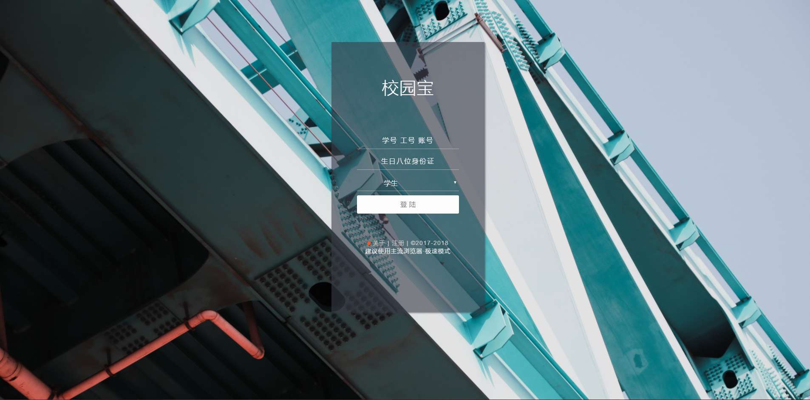

校园宝  
= 

### 校园宝是什么?
方便自己学院的大伙们更便捷的使用校园后勤

账号（学号 | 工号 | 账号） 密码（身份证8位生日）

目前校园宝搭建在学院的服务器上-也就是必须登录学院的校园网才能进行访问

***

### 预览

> Mobile首页

> PC首页

### 问题反馈
在使用中有任何问题，欢迎反馈给我，可以用以下联系方式跟我交流

* [邮箱-主题请填写校园宝](http://mail.qq.com/cgi-bin/qm_share?t=qm_mailme&email=YQAMDhIJFAoEIRAQTwIODA)主题请填写校园宝
* QQ: 604660039

### 感谢给我提出建议的各位

***