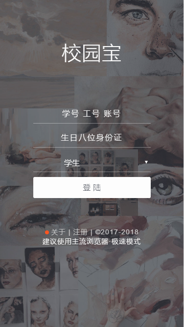
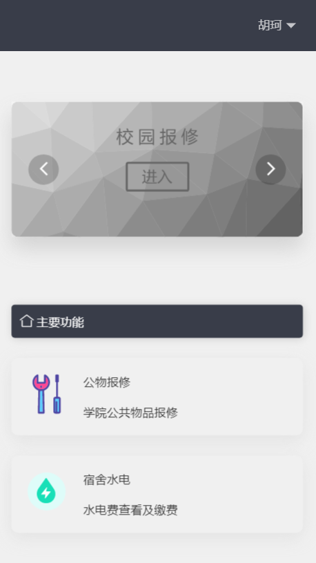

校园宝
= 

### 校园宝是什么?
方便学院更便捷的使用和管理学院后勤

账号（学号 | 工号 | 账号） 密码（出生8位生日 | OA密码 | 普通密码）

目前校园宝搭建在学院的服务器上-也就是必须登录学院的校园网才能进行访问

***

### 预览

> Mobile首页  

  

  

> PC首页  

  

### 问题反馈
在使用中有任何问题，欢迎反馈给我，可以用以下联系方式跟我交流  

* [邮箱-主题请填写校园宝](http://mail.qq.com/cgi-bin/qm_share?t=qm_mailme&email=YQAMDhIJFAoEIRAQTwIODA)主题请填写校园宝+你的问题  

### 感谢给我提出建议的各位

***

&copy; AmosHuKe. All Rights Reserved.
